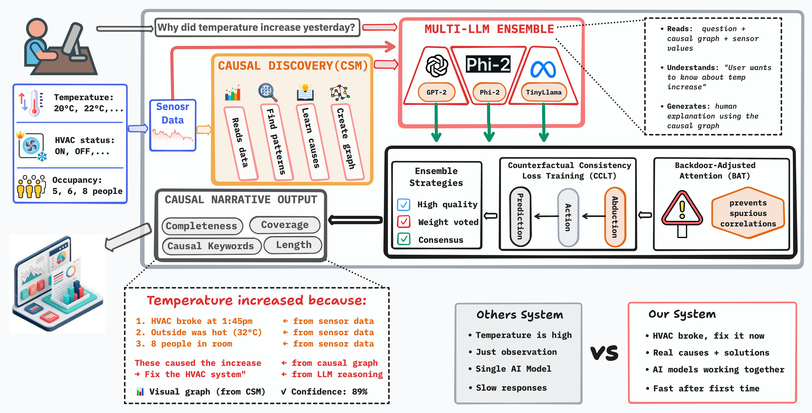

# Causal Sensor Language Models: Bridging Causal Discovery and LLMs for Temporal Sensor Analysis

[](https://opensource.org/licenses/MIT)
[](https://www.python.org/downloads/)

> [!NOTE]
> **Paper Status**: The paper for this repository will be submitted to an international conference in 2026. Experimental results will be published upon paper acceptance.

## 📖 Overview



**Causal Sensor Language Models (CSLM)** is a framework for generating causally-grounded explanations of temporal sensor data. When deploying interpretable IoT systems, CSLM answers the critical question: ***How can we explain sensor behavior in terms of cause and effect rather than mere correlations?***

### The Problem

Existing sensor analysis systems face a fundamental limitation:
- **Correlation-based methods**: Identify patterns but not mechanisms
- **Standard LLMs**: Generate fluent text but lack causal grounding
- **Black-box predictions**: Cannot answer "what if" questions or explain interventions

**Critical questions for practitioners:**
- What actually caused this sensor anomaly?
- How would the system behave under different conditions?
- Can we trust explanations for safety-critical decisions?
- Do causal models generalize across domains?

### The Solution

CSLM integrates **structural causal models** with **language model attention mechanisms** to provide three levels of understanding:

- **Causal Discovery**: Learn dependency graphs from sensor time series
- **Intervention Reasoning**: Estimate effects of actions using do-calculus P(Y | do(X))
- **Counterfactual Explanations**: Answer "what if" questions with formal consistency guarantees

---

## 🎯 Key Innovations

### 1. Causal Score Matching (CSM)

Score-based causal discovery with interventional diffusion. Learns interventional distributions p(x|do(z)) rather than just observational p(x).

```
∇_x log p(x_t | do(z)) = ∇_x log p(x_t) - γ(t)·∇_x D_KL(p(z_t|x_t) || p(z_t|pa(z)))
```

**Features**:
- Improved sample complexity over traditional methods
- Supports nonlinear dynamics
- Handles temporal lags in time series

### 2. Backdoor-Adjusted Attention (BAT)

Attention masking that explicitly encodes Pearl's backdoor criterion to prevent spurious correlations.

```
M_backdoor[i,j] = exp(-λ·|Z_ij*|) if backdoor set exists, else 0
```

**Multi-level explanations**:
- Level 1 (Observational): "Temperature = 28°C"
- Level 2 (Causal): "HVAC failure caused the increase"
- Level 3 (Counterfactual): "If HVAC worked → 22°C"

### 3. Counterfactual Consistency Loss (CCLT)

Training objective enforcing Pearl's 3-step algorithm (abduction → action → prediction).

```
L_counterfactual = L_factual + λ₁·L_abduction + λ₂·L_action + λ₃·L_prediction
```

---

## 🚀 Quick Start

### Installation

```bash
git clone https://github.com/hosei-university-iist-yulab/01-causal-slm.git
cd 01-causal-slm
pip install -r requirements.txt
pip install tigramite dowhy causalnex
```

### Usage

The framework provides a unified API for causal discovery, intervention reasoning, and natural language explanation generation. Initialize the model with your preferred configuration (CSM for discovery, BAT for attention, CCLT for consistency), load multivariate sensor time series data, and generate causally-grounded explanations.

---

## 📊 Methodology

### Pipeline Architecture

```
Input Time Series (multivariate sensor data)
    ↓
[Causal Discovery Module] CSM algorithm → Causal graph G
    ↓
[Causal Graph Encoder] Convert G to attention masks
    ↓
[Backdoor-Adjusted Attention] LLM + BAT masking
    ↓
[Intervention Reasoner] Backdoor/front-door adjustment
    ↓
[Language Generator] Causal narrative conditioned on G
    ↓
Natural Language Explanation
```

### Causal Discovery Process

CSM discovers causal graphs by learning interventional distributions:

1. **Score Matching**: Learn ∇_x log p(x_t | do(z)) via diffusion
2. **Graph Recovery**: Extract edges from learned score functions
3. **Temporal Extension**: Handle time lags τ ∈ {1, ..., T_max}
4. **Validation**: Verify identifiability via soft interventions

---

## 📚 Datasets

CSLM is designed for evaluation on diverse real-world domains with known causal structure:

| Dataset | Domain | Features | Causal Chain |
|---------|--------|----------|--------------|
| **Smart Home** | HVAC + Temperature | 7 | Outdoor temp → HVAC → Indoor temp |
| **Industrial IoT** | Machinery Monitoring | 26 | Load → Vibration → Temp → Failure |
| **Environmental** | Air Quality | 8 | Traffic → Emissions, Weather → Dispersion |
| **Synthetic** | Controlled | Variable | Known SCM with ground truth DAG |

---

## 🛠️ Technical Stack

- **Language**: Python 3.9+
- **Deep Learning**: PyTorch 2.0+
- **LLM Backbone**: HuggingFace Transformers (GPT-2, LLaMA-2, Mistral)
- **Causal Inference**: Tigramite (PCMCI), DoWhy, CausalNex
- **Time Series**: PyPOTS (preprocessing)

---

## 📄 Citation

If you use CSLM in your research, please cite our paper:

```bibtex
@inproceedings{messou2026cslm,
  title={Causal Sensor Language Models: Bridging Causal Discovery and LLMs for Temporal Sensor Analysis},
  author={Messou, Franck Junior Aboya and Zhang, Shilong and Chen, Jinhua and Wang, Weiyu and Liu, Tong and Tao, Yu and Yu, Keping},
  booktitle={International Conference on (To Be Determined)},
  year={2026},
  note={Under Review}
}
```

---

## 📚 Related Publications by Authors

#### 2025

<details>
<summary><b>[VTC2025-Spring]</b> Federated Fine-Tuning of Large Language Models for Intelligent Automotive Systems with Low-Rank Adaptation</summary>

```bibtex
@INPROCEEDINGS{Chen2025FedLLM,
  author={Chen, Jinhua and Messou, Franck Junior Aboya and Zhang, Shilong and Liu, Tong and Yu, Keping and Niyato, Dusit},
  booktitle={2025 IEEE 101st Vehicular Technology Conference (VTC2025-Spring)},
  title={Federated Fine-Tuning of Large Language Models for Intelligent Automotive Systems with Low-Rank Adaptation},
  year={2025},
  month={Jun},
  address={Oslo, Norway},
  doi={10.1109/VTC2025-Spring65109.2025.11174441}
}
```
</details>

<details>
<summary><b>[ICUFN 2025]</b> TSFormer: Temporal-Aware Transformer for Multi-Horizon Forecasting</summary>

```bibtex
@INPROCEEDINGS{Messou2025TSFormer,
  author={Messou, Franck Junior Aboya and Chen, Jinhua and Liu, Tong and Zhang, Shilong and Yu, Keping},
  booktitle={2025 Sixteenth International Conference on Ubiquitous and Future Networks (ICUFN)},
  title={TSFormer: Temporal-Aware Transformer for Multi-Horizon Forecasting with Learnable Positional Encodings and Attention Mechanisms},
  year={2025},
  month={Jul},
  address={Lisbon, Portugal},
  doi={10.1109/ICUFN65838.2025.11170021}
}
```
</details>

<details>
<summary><b>[Preprint]</b> Spec2LLM: Spectral Reprogramming for Frozen LLM Forecasting</summary>

```bibtex
@article{Messou2024Spec2LLM,
  author={Messou, Franck Junior Aboya and Chen, Jinhua and Wang, Weiyu and Tao, Yu and Yu, Keping},
  title={Spec2LLM: A Spectral-to-Language Reprogramming Framework for Power Load Forecasting with Frozen Large Language Models},
  journal={ResearchGate Preprint},
  year={2024},
  note={Available: https://www.researchgate.net/publication/396703425}
}
```
</details>

<details>
<summary><b>[CCNC 2025]</b> Enhancing Federated Learning with Decoupled Knowledge Distillation</summary>

```bibtex
@INPROCEEDINGS{Chen2025FedKD,
  author={Chen, Jinhua and Zhang, Shilong and Liu, Tong and Messou, Franck Junior Aboya and Yu, Keping},
  booktitle={2025 IEEE 22nd Consumer Communications \& Networking Conference (CCNC)},
  title={Enhancing Federated Learning in Consumer Electronics with Decoupled Knowledge Distillation against Data Poisoning},
  year={2025},
  month={Jan},
  doi={10.1109/CCNC54725.2025.10976151}
}
```
</details>

#### 2024

<details>
<summary><b>[VTC2024-Fall]</b> Byzantine-Fault-Tolerant Federated Learning for IoV</summary>

```bibtex
@INPROCEEDINGS{Chen2024Byzantine,
  author={Chen, Jinhua and Zhao, Zihan and Messou, Franck Junior Aboya and Katabarwa, Robert and Alfarraj, Osama and Yu, Keping and Guizani, Mohsen},
  booktitle={2024 IEEE 100th Vehicular Technology Conference (VTC2024-Fall)},
  title={A Byzantine-Fault-Tolerant Federated Learning Method Using Tree-Decentralized Network and Knowledge Distillation for Internet of Vehicles},
  year={2024},
  month={Oct},
  address={Washington, DC, USA},
  doi={10.1109/VTC2024-Fall63153.2024.10757805}
}
```
</details>

<details>
<summary><b>[VTC2024-Fall]</b> Short-Term Load Forecasting with CNN-BiLSTM</summary>

```bibtex
@INPROCEEDINGS{Messou2024LoadForecasting,
  author={Messou, Franck Junior Aboya and Chen, Jinhua and Katabarwa, Robert and Zhao, Zihan and Yu, Keping},
  booktitle={2024 IEEE 100th Vehicular Technology Conference (VTC2024-Fall)},
  title={Enhancing Short-Term Load Forecasting in Internet of Things: A Hybrid Attention-based CNN-BiLSTM with Data Augmentation Approach},
  year={2024},
  month={Oct},
  address={Washington, DC, USA},
  doi={10.1109/VTC2024-Fall63153.2024.10757868}
}
```
</details>

---

## 👥 Authors & Affiliations

**Franck Junior Aboya Messou** (Lead Author, Corresponding Author)
Graduate School of Science and Engineering, Hosei University, Tokyo 184-8584, Japan
📧 franckjunioraboya.messou@ieee.org | franckjunioraboya.messou.3n@stu.hosei.ac.jp

[ResearchGate](https://www.researchgate.net/profile/Franck-Junior-Aboya-Messou) | [IEEE Xplore](https://ieeexplore.ieee.org/author/274956027119414) | [Google Scholar](https://scholar.google.ca/scholar?hl=fr&as_sdt=0%2C5&q=franck+junior+aboya+messou&btnG=)

**Shilong Zhang, Jinhua Chen, Weiyu Wang, Tong Liu, Yu Tao**
Graduate School of Science and Engineering, Hosei University, Tokyo 184-8584, Japan

**Keping Yu** (Principal Investigator, Corresponding Author)
Hosei University / Waseda University, Tokyo, Japan
📧 keping.yu@ieee.org

---

## 📜 License

This project is licensed under the MIT License - see the [LICENSE](LICENSE) file for details.

---

## 🙏 Acknowledgments

This research is supervised by **Professor Keping Yu** (Hosei University / Waseda University, Tokyo, Japan).

**Implementation**:
- Built upon Tigramite (PCMCI implementation)
- HuggingFace Transformers and PyTorch communities

---

## 📧 Contact

For questions, collaboration, or access requests:
- **Email**: franckjunioraboya.messou@ieee.org
- **ResearchGate**: [Profile](https://www.researchgate.net/profile/Franck-Junior-Aboya-Messou)

---

**📝 Paper status**: Under review for international conference in 2026
